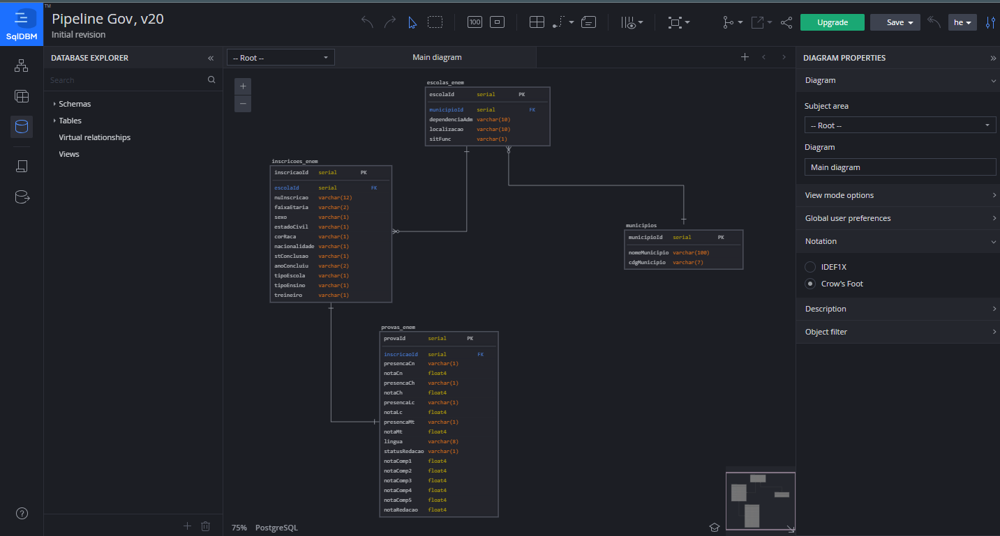

# Pipeline Gov Br

Pipeline de extração e carregamento dos dados abertos do Enem (1998-2023)

# Como rodar?
#### 1) Clone o Repositorio
#### 2) Crie um arquivo .env
Nesse arquivo adicione as variavéis:
  AIRFLOW_UID=1000
  PIPELINE_ENEM_URL="https://download.inep.gov.br/microdados/microdados_enem_year.zip"
  MINIO_ACESS_KEY=""
  MINIO_SECRET_KEY=""

#### 3) Suba o Minio
Pelo terminal, rode docker-compose up -d --build 'minio'. Ou clique com o botão direito sobre o docker-compose.yaml e selecione o service do minio

#### 4) Cria senhas de acesso no minio
Ao subir o serviço, logue em localhost:9001/login com o user "pipeline" e a senha "pipelinegov" e cria uma Acess Key e um Secret Key. Adicione essas variaveis no .env

#### 5) Suba o Airflow init
Pelo terminal, rode docker-compose up -d --build 'airflow-init'. Ou clique com o botão direito sobre o docker-compose.yaml e selecione o service do airflow-init

#### 6) Suba o restante dos serviços
Pelo terminal, rode docker-compose up -d --build. Ou clique com o botão direito sobre o docker-compose.yaml e selecione compose up

#### 7) Rode a Dag
Logue em localhost:8080 com o user airflow e a senha airflow
Selecione a dag extract_enem_data e rode-a
Obs: Por default, deixei o schedule de 10 em 10 minutos comentado por conta do tamanho dos arquivos do gov. Para definir o Schedule, basta descomentar a linha 2o do arquivo airflow/dags/extract.py e comentar a linha 21

# Pipeline

Os dados são retirados do Gov e colocados em um bucket Minio, orquestrados pelo Airflow. Abaixo imagens do projeto:

